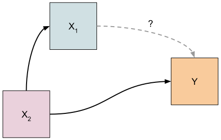

```{r}
#| echo: false
rm(list=ls()); library(tidyverse)
options(scipen=999)
```

## What is a Confouder?
Before we discuss what a confounder is, we need to briefly discuss the notion of
causality. Let's say we have a feature of the world[^FoTW], call it $Y$, that we
are interested in understanding. $Y$ might be an outcome like `has heart
disease` or `pulmonary capacity`. In addition, we want to understand the effect
that some other feature of the world exerts on the outcome. We'll call this the
treatment and label it $X_1$. If we were to go out into the world and take
measurements of $X_1$ and $Y$, we could examine their correlation. If a
correlation is present, does that mean that there is a causal relationship
between $Y$ and $X_1$? Maybe. The first thing we would want to establish is that
a causal relationship is plausible. In other words, does it make sense to think
that $X_1$ causes $Y$? If that seems reasonable, then it's important to consider
if there are other features of the world that might have a causal influence on
both $X_1$ and $Y$. Such a feature of the world would be a confounder. We can
depict these relationships in a path diagram.

{width=50%}

In this model, we can see that $X_2$ exerts a causal influence on both $X_1$ and
$Y$ (the one way arrows). The dashed grey line indicates that the treatment 
($X_1$) might have a direct effect on the outcome ($Y$). In order to be a 
confouder, $X_2$ must have an direct effect on the treatment *and* it must have a 
direct effect on the outcome. The treatment may or may not have a direct effect
on the outcome (hence the grey, dashed line and question mark). That's what 
is being assessed.

:::{.callout-warning}
Confounder relationships should be carefully considered conceptually rather than
numerically. Does the proposed causal relationship and direction of influence 
make sense? These considerations are more important than numerical associates in
your data.
:::

You have probably heard the expression "correlation does not imply causation".
Why is that the case? Well, confounders are a common reason why we cannot assume
causation just because two variables are correlated. Some or all of the
correlation between the treatment and the outcome may actually be explained by
the effect of the confounder on both treatment and outcome.

When considering if a given variable is a confounder, the following questions 
may be useful to you[^marin]:

1) Is the proposed confounding relationship conceptually feasible regardless of any data collected?
2) Is the relationship between the proposed confounder and the outcome conceptually feasible?
3) The confounder must influence the treatment. The reverse causal path (from treatment to confounder) cannot exist.  
4) The confounder cannot be in the path between the treatment and the response variable. In other words, it cannot mediate the relationship between the treatment and the outcome.

## Estimating the Bias
The identification of confounders is important when constructing effects models
because the omission of a confounder can bias the model estimate of the 
treatment effect. So what is the relationship between the estimate of the
treatment effect, the true size of the effect, bias and error?

$$
\text{Estimate} = \text{Estimand} + \text{Bias} + \text{Error}\tag{1}
$$

Equation 1 relates the model estimate to the true effect size, the estimand,
bias and error [@bueno_de_mesquita_thinking_2021]. Error is the result of random
noise and features that are not accounted for in the model. Bias is a systematic
deviation from the estimand and the omission of confounders from our model
introduces bias into the estimate of the treatment effect. *Controlling* for
confounders is the way that we eliminate this type of bias from our estimates.
So how do we control for $X_2$ in our hypothetical scenario?

We control for the confounder by including it in our model. Consider the "full"
model below that includes the treatment, confounder and outcome. The parameter
coefficients and the error term have the superscript $f$ to denote that they are
part of this full model.

$$
Y_i = \beta_0^f + \beta_1^fX_{i,1} + \beta_2^fX_{i,2} + \epsilon^f_i
$$

We can compare the full model to the reduced model that omits the confounder.
The reduced model parameter coefficients have the $r$ superscript to indicate
that they belong to the reduced model.

$$
Y_i = \beta_0^r + \beta_1^rX_{i,1} + \epsilon_i^r
$$

We can also regress the confounder on the treatment. The parameter $\omega$ is a
measure of the relationship between the confounder and treatment. If we centred
and scaled both variables, $\omega$ would be the correlation between the two
variables.
$$
X_{2,i} = \omega_0 + \omega_1X_{i,1}+\epsilon_i
$$

Using the parameter coefficients of the full and reduced models we can measure
the bias as in the equation below:
$$
\text{Bias} = \beta_1^r - \beta_1^f = \beta_2^f\cdot\omega_1.\tag{2}
$$

Equation 2 is often referred to as the omitted variable bias equation.

Depending upon the relationship between the confounder and the treatment and the
confounder and outcome, the bias will either produce an over or under estimate 
of the treatment effect. The table [@bueno_de_mesquita_thinking_2021] below summarises the possible directions of
bias based on these relationships.

| | Omitted Variable Positively Correlated with Treatment $\omega_1>0$ | Omitted Variable Negatively Correlated with Treatment $\omega_1<0$ |
|:-------:|:------:|:------:|
| **Omitted Variable Positively Correlated with Outcome**<br/>$\beta_2^f>0$ | Positive Bias<br />$\beta_2^f\cdot\omega_1>0$ | Negative Bias<br />$\beta_2^f\cdot\omega_1<0$ |
| **Omitted Variable Negatively Correlated with Outcome**<br/>$\beta_2^f<0$ | Negative Bias<br />$\beta_2^f\cdot\omega_1<0$ | Positive Bias<br />$\beta_2^f\cdot\omega_1>0$ |

## The Setup
Imagine a situation where you are interesting in estimating the effect that a
variable of interest called $X_1$ has on the variable $Y$. You know that when
considering the estimation of effects that identifying potential confounders is
important. Let's say that you have identified a variable, $X_2$ that has all of 
the attributes of a confounder described above. You decide to use the following
model to estimate the effect of $X_1$ on $Y$:

$$
\begin{aligned}
Y_i &= \beta_0 + \beta_1X_{i,1} + \beta_2X_{i,2} + \epsilon_i\\
\epsilon_i &\sim N(0,1)
\end{aligned}
$$

$Y$ will be related to the two predictors $X_1$ and $X_2$ with $\beta_0=2.5$,
$\beta_1=3.5$ and $\beta_2=1.5$. The random error, $\epsilon$ will be modeled
with a standard normal distribution ($\mu=0, \sigma^2=1$). For simplicity, the
two predictors will also have standard normal distributions, but they need not
have this distribution in reality.

We will consider four different relationships between the two predictors and
the response. The simplest case will consider when there is no relationship
between the two predictors. Then, we will look at the case where the confounder,
$X_2$, has a positive correlation with both $x_1$ and $Y$. Next, a negative
correlation between $X_1$ and $X_2$ but a positive correlation between $X_2$ and
$Y$ will be investigated. Finally, we'll look at the case where there is no
relationship between $X_1$ and $Y$, but both are correlated with $X_2$.

The correlation between $X_2$ and $X_1$ will be set using the `mvrnorm()`
function from the `MASS` package [@mass_pkg] to simulate two normally
distributed variables.

## Scenario 1 - No Confounding: Independent Predictors
For starters, lets think about the situation where $X_1$ and $X_2$ are not
related. They are independent of each other. We can generate from a multivariate
normal distribution using `mvrnorm` given the following definition:

$$
X = \begin{bmatrix}
\vdots & \vdots \\
X_1 & X_2 \\
\vdots & \vdots
\end{bmatrix} \sim N\bigg(\mu=\begin{bmatrix}0\\0\end{bmatrix},\Sigma=\begin{bmatrix}1&0\\0&1\end{bmatrix}\bigg).
$$
In this scenario, $X_2$ is not a confounder, so if it is excluded from the
model, we should not expect any bias in our estimate of $\beta_1$. In other
words, there should be no bias term in Equation 1. Our estimate of $\beta_1$
should be unbiased.

We can verify this by fitting two models. First, a full model that includes both
$X_1$ and $X_2$ will be fit. The parameter coefficient estimate and the standard
error for $\beta_1$ for this model will be compared to those of a model that
does not contain $X_2$. With no confounding, the estimates should be similar.
If $X_2$ is a good [independent predictor](independent-predictors.html) of $Y$, 
then its inclusion in the model should increase the precision of the estimate of
$\beta_1$. In other words, we should see the standard error associated with 
$\beta_1$ shrink when $X_2$ is included in the model.

```{r scenario 1}
library(MASS)
# X1 and X2 are not correlated
SIGMA <- matrix(c(1,0,0,1), ncol=2, byrow=TRUE)
N <- 100
# create a design matrix
set.seed(4) # for reproducibility
X <- MASS::mvrnorm(n=N, mu=c(0,0), Sigma=SIGMA)
# let the error be standard normally distributed
E <- rnorm(N)

x1 <- X[,1]
x2 <- X[,2]

# the "real" model of the relationship between x1, x2 and Y
Y <- 2.5 + 3.5*x1 + 1.5*x2 + E

lm.full <- lm(Y ~ x1 + x2)
lm.reduced <- lm(Y ~ x1)

beta_1.full <- coef(lm.full)[2]
beta_1.reduced <- coef(lm.reduced)[2]

# extract the va
SE_beta_1.full <- vcov(lm.full)[2,2] |> sqrt()
SE_beta_1.reduced <- vcov(lm.reduced)[2,2] |> sqrt()
```
After fitting the two models, the coefficient estimates can be extracted with
the `coef()` function and the standard errors from the `vcov()` function.

The estimate of $\beta_1$ is similar between the two models: 
$\hat{\beta}_{1,full}=`r beta_1.full`$ vs 
$\hat{\beta}_{1,reduced}=`r beta_1.reduced`$. The standard error is reduced by
about 50% ($SE_{full}(\hat{\beta}_1)=`r SE_beta_1.full`$ vs 
$SE_{reduced}(\hat{\beta}_1)=`r SE_beta_1.reduced`$), making the estimate of 
$\beta_1$ in the full model more precise.

## Scenario 2 - Confounding with a Positive Relationship Between $X_2$ and $X_1$ and $X_2$ and $Y$
Now, consider the case where the relationship between $X_1$ and $X_2$ is
positive. This is modeled with a positive population correlation of $\rho=0.70$. 

$$
X = \begin{bmatrix}
\vdots & \vdots \\
x_1 & x_2 \\
\vdots & \vdots
\end{bmatrix} \sim N\bigg(\mu=\begin{bmatrix}0\\0\end{bmatrix},\Sigma=\begin{bmatrix}1&0.7\\0.7&1\end{bmatrix}\bigg).
$$
$X_2$ and $Y$ are also positively correlated via $\beta_2=1.5$. Since both
relationships have the same direction, the absence of $X_2$ from the model will
create a positive bias in $\hat{\beta}_1$, resulting in a over-estimate of the
effect of $X_1$ on $Y$.
```{r scenario 2}
SIGMA <- matrix(c(1,0.7,0.7,1), ncol=2, byrow=TRUE)

set.seed(23)
# create a design matrix
X <- MASS::mvrnorm(n=N, mu=c(0,0), Sigma=SIGMA)
E <- rnorm(N)
x1 <- X[,1]
x2 <- X[,2]

Y <- 2.5 + 3.5*x1 + 1.5*x2 + E

# fit the two models
lm.full <- lm(Y ~ x1 + x2)
lm.reduced <- lm(Y ~ x1)
# and extract the beta 1 coefficient from each model
beta_1.full <- coef(lm.full)[2]
beta_1.reduced <- coef(lm.reduced)[2]

# extract the standard errors from the variance/covariance matrix for the betas
SE_beta_1.full <- vcov(lm.full)[2,2] |> sqrt()
SE_beta_1.reduced <- vcov(lm.reduced)[2,2] |> sqrt()
```

The over-estimate is now evident. If $X_2$ is excluded from the model 
$\hat{\beta}_{1,reduced}=`r beta_1.reduced`$ which is an increase of 27% over
the true population value of 3.5. If we control for $X_2$ however, the estimate
is $\hat{\beta}_{1,full}=`r beta_1.full`$, which is much closer to the true
population value of $\beta_1$.

We can quantify the bias using either $\beta_1^r -\beta_1^f$ or 
$\omega_1\cdot\beta_1^r$. Using the difference of parameter estimates from the
full and reduced models gives us 
$\text{Bias}=\beta_1^r -\beta_1^f = `r round(beta_1.reduced - beta_1.full,3)`$, or we can 
fit a model that regresses $X_2$ on $X_1$ and then use the expression 
$\text{Bias}=\omega_1\cdot\beta_1^r$.

```{r calculate bias}
lm.x1x2 <- lm(x2 ~ x1)
```

$\text{Bias}=\omega_1\cdot\beta_1^r = `r round(coef(lm.x1x2)[2]*coef(lm.full)[3],3)`$. We 
get the same result regardless of the choice of method.

## Scenario 3 - Confounding with a Negative Relationship Between $X_2$ and $X_1$
In this scenario, $X_2$ and $X_1$ are negatively correlated ($\rho=-0.7$) while
$X_2$ and $Y$ remain positively correlated.

$$
X = \begin{bmatrix}
\vdots & \vdots \\
x_1 & x_2 \\
\vdots & \vdots
\end{bmatrix} \sim N\bigg(\mu=\begin{bmatrix}0\\0\end{bmatrix},\Sigma=\begin{bmatrix}1&-0.7\\-0.7&1\end{bmatrix}\bigg).
$$
This should induce an under-estimate of $\beta_1$ in the model that does not
contain $X_2$.

```{r scenario 3}
SIGMA <- matrix(c(1,-0.7,-0.7,1), ncol=2, byrow=TRUE)

set.seed(0)
# create a design matrix
X <- MASS::mvrnorm(n=N, mu=c(0,0), Sigma=SIGMA)
E <- rnorm(N)
x1 <- X[,1]
x2 <- X[,2]

Y <- 2.5 + 3.5*x1 + 1.5*x2 + E

lm.full <- lm(Y ~ x1 + x2)
lm.reduced <- lm(Y ~ x1)

beta_1.full <- coef(lm.full)[2]
beta_1.reduced <- coef(lm.reduced)[2]

# extract the standard errors from the variance/covariance matrices of the betas
SE_beta_1.full <- vcov(lm.full)[2,2] |> sqrt()
SE_beta_1.reduced <- vcov(lm.reduced)[2,2] |> sqrt()
```
Indeed, that's what we see. The estimate of $\beta_1$ in the model that excludes
$X_2$ is $\hat{\beta}_{1,reduced}=`r beta_1.reduced`$ which is an decrease of
25% from the true population value of 3.5. If we control for $X_2$ however, the
estimate is $\hat{\beta}_{1,full}=`r beta_1.full`$, which is again much closer
to the true population value $\beta_1$.

## Scenario 4 - Confounding with No Relationship between $X_1$ and $Y$
Finally, we consider the situation where all of the correlation between the
treatment and outcome is the result of effects of the confounder. $X_2$ and 
$X_1$ are, of course, correlated. Their distribution is
$$
X = \begin{bmatrix}
\vdots & \vdots \\
x_1 & x_2 \\
\vdots & \vdots
\end{bmatrix} \sim N\bigg(\mu=\begin{bmatrix}0\\0\end{bmatrix},\Sigma=\begin{bmatrix}1&-0.5\\-0.5&1\end{bmatrix}\bigg),
$$
which indicates that they are moderately negatively correlated. In this
situation, the correlation between the treatment and outcome should effectively
disappear once the confounder is controlled for.

```{r scenario 4}
SIGMA <- matrix(c(1,-0.5,-0.5,1), ncol=2, byrow=TRUE)

set.seed(0)
# create a design matrix
X <- MASS::mvrnorm(n=N, mu=c(0,0), Sigma=SIGMA)
E <- rnorm(N)
X1 <- X[,1]
X2 <- X[,2]

Y <- 2.5 + 0*X1 + 1.5*X2 + E # there is no actual association between X1 & Y

lm.full <- lm(Y ~ X1 + X2)
lm.reduced <- lm(Y ~ X1)

beta_1.full <- coef(lm.full)[2]
beta_1.reduced <- coef(lm.reduced)[2]
```
First, let's take a look at the reduced model, which does not control for the
confounder, $X_2$.

```{r}
library(gt)
summary(lm.reduced) |> broom::tidy() |> 
  mutate(
    p.value = scales::pvalue(p.value, accuracy=0.0001)
  ) |> 
  gt() |> fmt_number(decimals=3) |> 
  tab_style(
    style=cell_text(weight = "bold"),
    locations=cells_body(columns=p.value, rows=term == "X1")
  )
```
This model indicates that the treatment is statistically significant
($\beta_1=-0.631$, $p=0.0003$). However, after controlling for the confounder,
we see that $\hat{\beta}_1$ is no longer reliably different to zero
($\beta_1=−0.027$, $p=0.8274$). The effect of $X_1$ on $Y$ is eliminated when
$X_2$ is included in the model.

```{r}
summary(lm.full) |> broom::tidy() |> 
  mutate(
    p.value = scales::pvalue(p.value, accuracy=0.0001)
  ) |> 
  gt() |> fmt_number(decimals=3) |> 
  tab_style(
    style=cell_text(weight = "bold"),
    locations=cells_body(columns=p.value, rows=p.value > 0.05)
  )
```

## In Summary

Summarise what it means to be a confounder and the ways that an omitted
confounder can bias the effect of the treatment.

## References

::: {#refs}
:::

[^FoTW]: This expression comes from the excellent book Thinking Clearly with
Data. I find that it is a very intiutive and accessible way to refer to what
will become the columns of a dataset: the variables that we collect data on and
have research questions about. I will use it interchangeable with "variable"
throughout this guide. [@bueno_de_mesquita_thinking_2021]
[^marin]: A lot of the background information for this guide comes from the 
excellent You Tube channel 
[MarinStatsLectures-R Programming & Statistics](https://www.youtube.com/@marinstatlectures). 
In particular, the playlist [Regression Modeling in Health Research](https://www.youtube.com/playlist?list=PLqzoL9-eJTNBDAG955KrzpduiPCj8-_3m) was very useful.