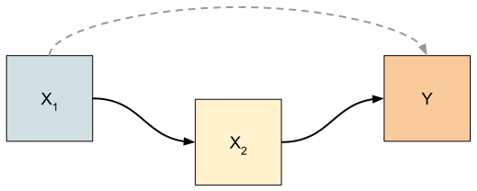
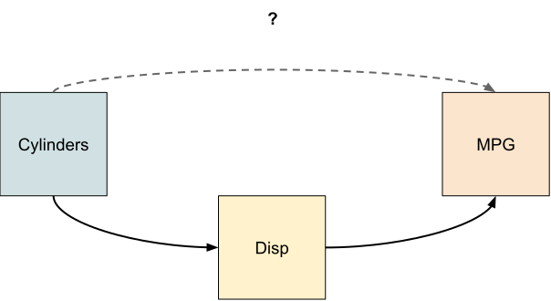
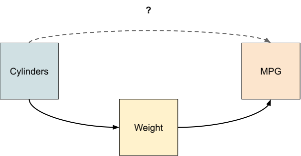
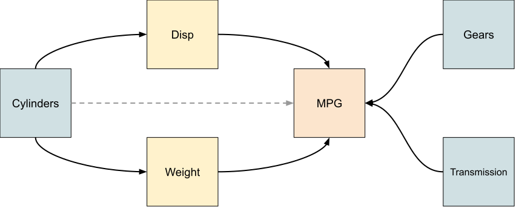
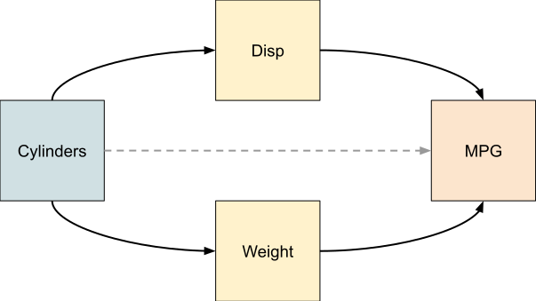

```{r initial setup}
#| echo: false
rm(list=ls()); 
options(scipen=999)
```

## What is a Mediator?
A mediator is the mechanism by which some feature of the world [^FoTW], the 
treatment, affects another feature of the world, the outcome. The effect of the
treatment may be thought of as "flowing through" the mediator in whole or in
part. The diagram below depicts this graphically.

{width=50%}

In this simple model, the effect of $X_1$ on $Y$ is mediated, in part, by $X_2$.
There is an additional effect (dashed grey line) of $X_1$ on $Y$ that is not 
mediated by $X_2$.

When constructing an effects model to investigate the effect of the treatment on
the outcome, it may be useful to include mediators in the model if a more 
granular analysis of the treatment effect is desired. However, if the total
effect of the treatment is the goal, then any mediators should be excluded from
the model. When constructing an effects model, it is important to understand the
relationships between the treatment variable and the other predictors in the
model be they mediators, [confounders](confounders.html) or 
[independent predictors](independent-predictors.html). The decision to include 
or exclude specific predictors should be weighed against their conceptual
relationships with the treatment and the outcome. Including predictors into the
model without forethought risks creating a biased estimate of the treatment
effect.

## Example - The Effect of Cylinder Count on Fuel Economy
Imagine that you have been asked by an engine design company to investigate the
effect of the number of cylinders in an internal combustion engine and the fuel
consumption measured in miles per gallon (`mpg`). The company provides you a
dataset containing 6 variables on 32 different vehicle models. They have asked
you to build an effects model and to identify any important mediators and/or
independent predictors that help establish the effect of the number of engine
cylinders on fuel economy. If there are any mediators, they would like to 
know the partial effect of these predictors as well.

The dataset you are provided has the following variables: `mpg`, `cyl`, `disp`, 
`wt`, `gear` and `am` where

- `mpg`: Miles/(US) gallon  
- `cyl`: Number of cylinders  
- `disp`: Displacement (cu.in.)  
- `wt`: Weight (1000 lbs)  
- `gear`: Number of forward gears  
- `am`: Transmission (0 = automatic, 1 = manual)  

### Considering Potential Relationships
Prior to building any statistical models, it is important to consider and
classify any potential relationships between the treatment, response and the
other variables in the dataset. First, is it reasonable to assume that the two
variables in questions have some sort of relationship? If so, is it plausible,
or well established in the literature, that there is a causal relationship
between them? What is the direction of causality? If assessing the treatment and
a potential covariate, if the two are independent, is it reasonable to conclude
that the covariate has an association with the response? We will use this line
of reasoning to assess the variables in our hypothetical situation.

### Number of Cylinders and Displacement
We start by considering if the number of cylinders in an engine is associated 
with the engine's displacement. Here, it helps to know the definition of engine
displacement: Displacement is a measure of the volume of air swept through the 
cylinders by the pistons during one complete cycle. It is typically measured in
litres or cubic inches. Clearly there is an association between the number of
cylinders and the displacement of an engine. It is also reasonable to conclude
that the number of cylinders causes the displacement by the definition of
displacement. 

If we look at a boxplot of `cyl` v `disp` it is clear that there are baseline
differences in the displacement based on the number of cylinders in the engine,
and the change in displacement is in the direction we expect: engines with more
cylinders have larger displacements.

```{r cyl v disp}
#| fig-align: "center"
#| fig-height: 3.5
library(tidyverse); library(latex2exp)
theme_set(theme_bw()) # set base theme for all plots

df <- mtcars |> 
  select(mpg, cyl, disp, wt, gear, am) |> 
  mutate(
    cyl = as_factor(cyl),
    gear = as_factor(gear),
    am = as_factor(am)
  )

ggplot(data=df, aes(x=cyl, y=disp)) +
  geom_boxplot(outliers=FALSE) +
  geom_jitter(alpha=0.5, width=0.25) +
  labs(
    y=TeX("Displacement ($inches^3$)"),
    x="Number of cylinders"
  )
```
Larger engines have more cylinders which means that they have larger
displacements. Is there an association between engine displacement and fuel
consumption? This certainly seems plausible. Larger engines are more powerful
and it seems likely that they also consume more fuel.

```{r}
#| fig-align: "center"
#| fig-height: 3.5
ggplot(data=df, aes(x=disp, y=mpg)) +
  geom_point() +
  labs(
    y="Fuel economy (mpg)",
    x=TeX("Displacement ($inches^3$)")
  )
```
There is clearly a strong, negative (and nonlinear) association between `disp`
and `mpg`. It seems reasonable to think that engine displacement mediates the
relationship between the number of cylinders and fuel economy. Engine 
displacement is in the path between the treatment, number of cylinders and the
outcome, fuel economy. It is a mechanism by which the number of cylinders
affects the fuel economy of the engine.

{width=50%}

Is engine displacement the only mechanism by which the number of cylinders 
affects fuel economy?

### Number of Cylinders and Vehicle Weight
An association between the number of cylinders in the engine and total vehicle
weight seems quite plausible. It also seems reasonable that this association
might not be as strong as that between the number of cylinders and engine
displacement as there are factors other than the engine size which influence the
overall weight of a vehicle. While this association is less clear cut, the plot
below clearly shows that there is difference in baseline weight for the different
number of cylinders. Conceptually it makes sense that engines with more cylinders
will cause the overall weight of the vehicle to increase because larger engines
are heavier.

```{r cyl v wt}
#| fig-align: "center"
#| fig-height: 3.5
ggplot(data=df, aes(x=cyl, y=wt)) +
  geom_boxplot(outliers=FALSE) +
  geom_jitter(alpha=0.5, width=0.25) +
  labs(
    y="Weight (1000s lbs)",
    x="Number of cylinders"
  )
```
Since a heavier vehicle consumes more fuel, all else being equal, it seems 
reasonable that weight might partially mediate the relationship between the
number of cylinders in the engine and the overall weight of a vehicle.

{width=50%}

There is a clear, strong and negative association between vehicle weight and
fuel economy as seen in the plot below, which lends credence to the notion
that weight is a mediator between number of engine cylinders and fuel
consumption.

```{r mpg v wt}
#| fig-align: "center"
#| fig-height: 3.5
ggplot(data=df, aes(x=wt, y=mpg)) +
  geom_point() +
  labs(
    y="Fuel economy (mpg)",
    x="Weight (1000s lbs)"
  )
```

### Number of Cylinders and Number of Gears and Transmission
There may be associations between these variables due to consumer preferences or
other economic considerations, but it doesn't seem plausible that the number of
cylinders would dictate the number of gears or the transmission type. The 
reverse causal path also seems implausible. That said, these two variables may 
be useful [independent predictors](independent-predictors.html) that we may want
in the model and so their impact on the estimate of the effect of the number of
cylinders as well as on the standard error of that estimate will be assessed.

## The Initial Estimated Effects Model
The causal model that we will investigate posits that the number of cylinders,
which is the treatment, acts on fuel economy, the outcome, through at least
two mechanism: engine displacement, vehicle weight and potentially directly. In
addition, there are two independent predictors: the number of forward gears and
the transmission type. We are explicitly stating that there are no interactions
between the treatment and other predictors in the model.

{width=50%}

To examine this model, we start by fitting the full model:

$$
\text{mpg}_i = \beta_0 + \beta_1I_{cyl6} + \beta_2I_{cyl8} + \beta_3x_{disp,i} + \beta_4x_{wt,i} + \beta_5I_{gear4} + \beta_6I_{gear5} + \beta_7I_{auto} + E_i.
$$

```{r fit full model}
mod.full <- lm(mpg~cyl+wt+disp+gear+am, data=df)
CI <- confint(mod.full) |> round(2) # get the 95% CIs for display in the report.
mod.full |> summary()
```
There is evidence that the number of cylinders has an impact on fuel
consumption, with additional cylinders resulting in an decrease in fuel economy
(lower `mpg`). The weight mechanism is reliably different to zero 
($p=0.0166$, $CI_{95\%}[`r CI[4,1]`,`r CI[4,2]`]$) and we can expect that, on 
average, for a 1000lb increase in overall vehicle weight, the fuel economy
decreases by 3.58 miles per gallon. There is no evidence in this data that the
slope coefficient associated with engine displacement is different to zero
($p=0.7356$, $CI_{95\%}[`r CI[5,1]`,`r CI[5,2]`]$). However, because we are 
interested the effect of the treatment through the known mediators it will be 
retained in the model.

Vehicles with four ($p=0.8472$, $CI_{95\%}[`r CI[6,1]`,`r CI[6,2]`]$) or five 
($p=0.5170$, $CI_{95\%}[`r CI[7,1]`,`r CI[7,2]`]$) forward gears do not, on
average, have fuel economies that are different to vehicles with only 3 forward
gears. Similarly, there is no evidence of an effect of transmission type 
($p=0.6983$, $CI_{95\%}[`r CI[8,1]`,`r CI[8,2]`]$)

## The Final Estimated Effects Model
We will want to drop `gear` and `am` from the final model, unless their
inclusion substantially improves the standard errors associated with the levels
of `cyl`. The final effects model is 

$$
\text{mpg}_i = \beta_0 + \beta_1I_{cyl6} + \beta_2I_{cyl8} + \beta_3x_{disp,i} + \beta_4x_{wt,i} + E_i.
$$

```{r fit final model}
mod.fin <- lm(mpg~cyl+wt+disp, data=df)
CI.fin <- confint(mod.fin) |> round(2)
mod.fin |> summary()
```
The removal of the two independent predictors did not change the standard errors
of the levels of `cyl` so there is no reason to keep these predictors in the 
final mode.

{width=50%}

This model can be compared to a total effect model where the outcome is
regressed solely on the treatment. Here, you can see that the effect of
additional cylinders is noticeably larger than in the model that includes the
mediators. If our causal model is correct (and that is open to debate!), then
there is a substantial effect of the number of cylinders on fuel economy above
and beyond the effect on fuel economy through the mechanisms of weight and
engine displacement.

$$
\text{mpg}_i = \beta_0 + \beta_1I_{cyl6} + \beta_2I_{cyl8} + E_i
$$

```{r}
mod.tot_eff <- lm(mpg~cyl, data=df)
mod.tot_eff |> summary()
```

## In Summary
If the goal of a model is to assess the effect of a treatment on an outcome, 
then it is important to carefully consider what predictors should be added to the
model and which should not. Constructing a causal diagram that reflects your 
hypothesised set of relationships helps you to create to a model that reflects
your conceptual understanding of the system and how variables are related to one
another. While it is important to include all known 
[confounders](confounders.html) in the model (if data has been collected on 
them), the decision to include or exclude mediators is, perhaps, more nuanced.
As demonstrated above, the inclusion of mediators will change the parameter
estimate(s) associated with the treatment. If done unintentionally, this will
result in a biased estimate of the treatment. However, if done with intent, it
can painted a more detailed picture of how the treatment affects the outcome.

## References

::: {#refs}
:::

[^FoTW]: This expression comes from the excellent book Thinking Clearly with
Data. I find that it is a very intuitive and accessible way to refer to what
will become the columns of a dataset: the variables that we collect data on and
have research questions about. I will use it interchangeable with "variable"
throughout this guide. [@bueno_de_mesquita_thinking_2021]
